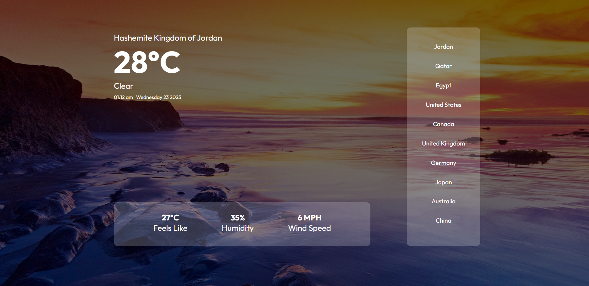

# Weather App

## Overview

The Weather App is a simple web application that allows users to retrieve real-time weather information for different locations. Users can search for a specific location and view details such as temperature, weather conditions, humidity, and wind speed. The app displays the weather data using React.js and fetches information from the OpenWeatherMap API.

## Features

- Search for weather information by location.
- Display real-time weather data including temperature, weather conditions, humidity, and wind speed.
- Convert temperature from Fahrenheit to Celsius.
- Display local time for the selected location.
- Responsive design for various screen sizes.

## How it Works

1. When the app is loaded, the user is presented with a search input where they can enter a location.
2. Upon pressing the "Enter" key, the app sends a request to the OpenWeatherMap API to retrieve weather data for the entered location.
3. The API responds with weather information, including temperature, weather conditions, humidity, wind speed, and timezone offset.
4. The app then displays the retrieved data on the screen, including converted temperature and local time for the selected location.

## Installation

1. Clone the repository to your local machine.
2. Navigate to the project directory using the command line.
3. Run `npm install` to install the project's dependencies.
4. Obtain an API key from [OpenWeatherMap](https://openweathermap.org/) and replace `"YOUR_API_KEY"` with your actual API key in `src/components/main.js`.
5. Run `npm start` to start the development server.

## Technologies Used

- React.js: Front-end framework for building user interfaces.
- Axios: Promise-based HTTP client for making API requests.
- OpenWeatherMap API: External API for retrieving weather data.
